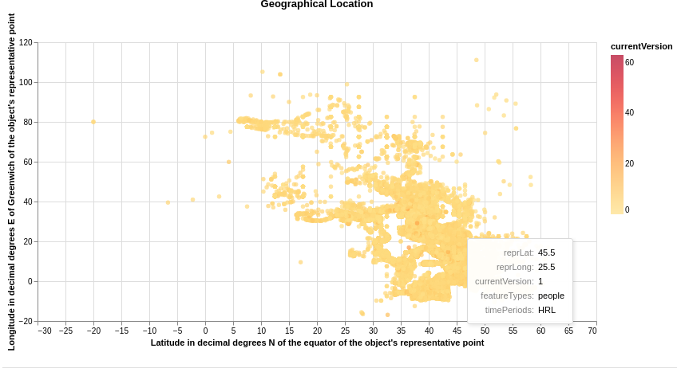

### Visualization 1
**Aim (aim):** This visualization aims to find the object's geographical position by mapping its latitude and longitude along with the version. From that particular location of the object, infer what kind of feature type is existing. For eg: temple, settlement etc. Here in the visualization we could see most of the data points are on south-east part of the chart and there are outliers as well around the cluster.

**Visual Design Type (vistype):** Scatter Plot

**Image:** 


Source Code
Source Code
```python
# importing the necessary libraries altair and pandas for data visualization and manipulation
import altair as alt
import pandas as pd
alt.data_transformers.disable_max_rows()

# reading data from url and store it in places_data
places_data_url='https://raw.githubusercontent.com/SwanseaU-TTW/csc337_coursework1/master/pleiades-places-latest.csv'
places_data = pd.read_csv(places_data_url)

# creating a base structure for chart using the places_data
selector = alt.selection_single(empty='all', fields=['X','Y'])
base_main = alt.Chart(places_data, title='Geographical Location').properties(
    width=700,
    height=350
).add_selection(selector)

# creating a chart for the main design and assign to a variable
geo_points = base_main.mark_circle().encode(
    alt.X('reprLat',title="Latitude in decimal degrees N of the equator of the object's representative point",
          scale=alt.Scale(domain=(-30, 70))),
    alt.Y('reprLong',title="Longitude in decimal degrees E of Greenwich of the object's representative point",
          scale=alt.Scale(domain=(-20, 120))),
    alt.Color('currentVersion', scale=alt.Scale(scheme='yelloworangered')),
    tooltip=['reprLat', 'reprLong', 'currentVersion', 'featureTypes', 'timePeriods']).interactive()

# display visualization
geo_points
```


**Visual Mappings (vismapping):** The unique concept that generated from an intricate amount of data is to visualize the objects for their different versions along with geographical locations with the help of latitude and longitude. Hence the visualization is done by plotting the latitude on X axis and longitude on Y axis. That would give us the position and scatter plot is used for this concept to make a visualization. The next objective was to plot versions of each entry and we are able to make the color factor to define the versions. More instensity relates to latest version. Less intensity refers to older version. An interactive element is made by giving a tooltip for every points to display the details including feature types and timeperiod.

**Data Preparation (dataprep):** Data is taken from pleiades-places-latest.csv. This file has fields for latitude(reprLat) and longitude(reprLong) to plot the location and a field for storing version(currentVersion). For identifying feature type of that location, data was taken from featureTypes field and timePeriods field is used for plotting time period into the tooltip.

**Improvements (improvements):** Improvements could be done by plotting the geo cordinates to actual world maps and even the time periods and feature types could be specifically given. For the feature types it would be great to give a unique small icon for every points. For eg: if the feature type is a temple then a small icon of temple could be shown in the plot.

