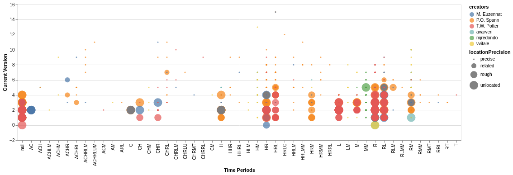

### Visualization 5
**Aim (aim):** From this visualisation we could see various information regarding six known creators and their respective records in different time periods and versions. The precision of locations that they plotted are also communicating to the user. From the plot we could easily infer that most of the records are precised by its location. When the version increases the location is more precised. Vvitale has only one unlocated data and its in the version 0. According to the visualisation T.W. Potter has more number of unlocated data and when version increases the the data had been more precised.

**Visual Design Type (vistype):** Multi Feature Scatter Plot

**Image:** 
- - -


Source Code
```python

# importing the necessary libraries altair and pandas for data visualization and manipulation
import altair as alt
import pandas as pd
alt.data_transformers.disable_max_rows()

# fetch data from url
places_data_url = 'https://raw.githubusercontent.com/SwanseaU-TTW/csc337_coursework1/master/pleiades-places-latest.csv'
places_data = pd.read_csv(places_data_url)

# creating new data frame and filter required data
df2 = pd.DataFrame(places_data)
df2_selected_columns = df2[['id','locationPrecision','timePeriods','creators','featureTypes','minDate','maxDate','currentVersion']]
new_df2 = df2_selected_columns.copy()

creator_avarveri = new_df2.loc[new_df2['creators'].isin(['avarveri'])]
creator_mjredondo = new_df2.loc[new_df2['creators'].isin(['mjredondo'])]
creator_vvitale = new_df2.loc[new_df2['creators'].isin(['vvitale'])]
creator_spann = new_df2.loc[new_df2['creators'].isin(['P.O. Spann'])]
creator_euzennat = new_df2.loc[new_df2['creators'].isin(['M. Euzennat'])]
creator_potter = new_df2.loc[new_df2['creators'].isin(['T.W. Potter'])]

frames = [creator_avarveri, creator_mjredondo, creator_vvitale, creator_spann, creator_euzennat, creator_potter]
creators = pd.concat(frames)

source = creators

alt.Chart(source).mark_circle().encode(
    alt.X('timePeriods',title='Time Periods', scale=alt.Scale(zero=False)),
    alt.Y('currentVersion',title='Current Version', scale=alt.Scale(zero=False, padding=1)),
    color='creators',
    size='locationPrecision'
)


```

**Visual Mappings (vismapping):** The visualization is created by scatter plot, but with multiple features in it. The X and y axes are mapped to time periods and current version respectively. At the same time, size of the circle is mapped to location precision and color is mapped to creators. Since there are only six creators selected for plotting, there would be unique colors for each creator. Time Periods could be mapped to colors but since there are lot of different time periods available in data frame, we decided to plot time frame in X axis.  

**Data Preparation (dataprep):** For plotting datas to this visualisation, we need four different kinds of data. Time periods and version data are pretty straight forward. For the creator data some filteration has been done to select six known creators from the whole data in pleiades-places-latest.csv. The selected creaors are Avarveri, Mjredondo, Vvitale, P.O. Spann, M. Euzennat and T.W. Potter. A new data frame is created and filtered the following columns: 'id', 'locationPrecision', 'timePeriods', 'creators', 'featureTypes', 'minDate', 'maxDate', 'currentVersion'. The next task was to filter the selected six creators and join them together. Six different data frames are created for creators and concat() method from pandas library was used for concatenating the frames together.

**Improvements (improvements):** Precise locations are too feable to notice. Some datas are overlapping and this makes it difficult to identify which creator's data is that point. 

