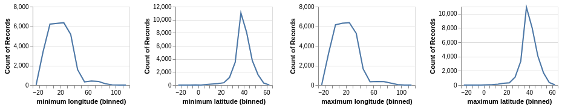
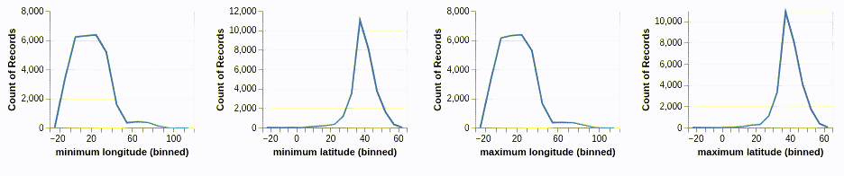

### Visualization 3
**Aim (aim):** From this visualization we could see that number of records for plotting a bounded area for pleiades in four differnt plots. Minimum latitude and minimum longitude which represent the bottom right corner of the bounded area has more records od data when longitude between -20 to 60. At the same time, minimum latitude has more records when the values in between 20 and 60, and has more than 10000 records at approximately 40. Maximum latitude and longitude have the similar range of records like in minimum. 

**Visual Design Type (vistype):** Interactive Crossfilter

**Image:** 
- - -

- - -
Interactivity


Source Code
```python
# importing the necessary libraries altair and pandas for data visualization and manipulation
import altair as alt
import pandas as pd
from vega_datasets import data
alt.data_transformers.disable_max_rows()

# fetching the data from url
places_data_url = 'https://raw.githubusercontent.com/SwanseaU-TTW/csc337_coursework1/master/pleiades-places-latest.csv'
places_data = pd.read_csv(places_data_url)
bbox = places_data['bbox'].str.split(",", n = 3, expand = True)
bbox.columns = ['minimum longitude','minimum latitude','maximum longitude','maximum latitude']

brush = alt.selection(type='interval', encodings=['x'])

# Define the base chart, with the common parts of the
# background and highlights
base = alt.Chart().mark_line().encode(
    x=alt.X(alt.repeat('column'), type='quantitative', bin=alt.Bin(maxbins=20)),
    y='count()'
).properties(
    width=160,
    height=130
)

# gray background with selection
background = base.encode(
    color=alt.value('#ddd')
).add_selection(brush)

# blue highlights on the transformed data
highlight = base.transform_filter(brush)

# layer the two charts & repeat
alt.layer(
    background,
    highlight,
    data=bbox
).repeat(column=['minimum longitude','minimum latitude','maximum longitude','maximum latitude'])


```


**Visual Mappings (vismapping):** The basic concept was to identify number of records and compare the occurrences of most two ends of the bounded area (bottom-right and top-left). We had the data from the field bbox. So for this concept we would need all four geo context location points and number of records present for each point. Altair is used for creating this visualization with the help of repeat functions we are able to make the four differnt plots to make an interactive crossfilter. Interactivity is added to chart for comparing number of records for each location coordinate. In the images above we could see plot and its interactivity in the second image. Y axis is taken for plotting the count of records and geo coordinate points are plotted on X axis. X axis values are binned for avoiding minor observation errors.

**Data Preparation (dataprep):** For this visualization data analysis and preparation had to be done. The required data is present in the column bbox in the file pleiades-places-latest.csv. The challenge was to separate values of bbox to different columns in a new dataframe so that we could plot directly from that dataframe. Pandas library functions are used for reading the data from url and python's split function is used for separating the content in this column. Analysing the data, we understood that the geographical coordinates are separated by comma. After splitting, appropriate column headings are given. 

**Improvements (improvements):** Instead of record counts, there could be another values given so that comparison would be more specific related to the coulmns which is in the data file itself. For eg: Plotting latitude and longitude value of location along with bbox would give us the relation between bounded area and location and thereby conclude that it woud be a precise location.

