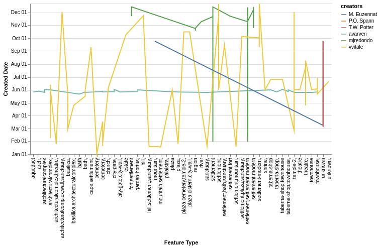

### Visualization 4
**Aim (aim):** The aim of this visualization is to compare and evaluate the feature types rgarding to created date of six known creators such as Avarveri, Mjredondo, Vvitale, P.O. Spann, M. Euzennat and T.W. Potter. From this visualization we could infer that Vvitale has created almost all kind of feature types and has great span of created date in a year as well. Avarveri has created mostly during June and he has got wide variety of feature types in his records. T.W. Potter's feature types are unknown. Mjredondo has created records in between March to October.

**Visual Design Type (vistype):** Parallel Coordinates

**Image:** 
- - -


Source Code
```python
# importing the necessary libraries altair and pandas for data visualization and manipulation
import altair as alt
import pandas as pd
from vega_datasets import data
alt.data_transformers.disable_max_rows()

# fetch data from url
locations_data_url = 'https://raw.githubusercontent.com/SwanseaU-TTW/csc337_coursework1/master/pleiades-locations-latest.csv'
locations_data = pd.read_csv(locations_data_url)

# create new data frame 
df2 = pd.DataFrame(locations_data)
df2_selected_columns = df2[['featureType','created','locationPrecision','timePeriods','creators','minDate','maxDate','currentVersion']]
new_df2 = df2_selected_columns.copy()

# filter data for certain creators
creator_avarveri = new_df2.loc[new_df2['creators'].isin(['avarveri'])]
creator_mjredondo = new_df2.loc[new_df2['creators'].isin(['mjredondo'])]
creator_vvitale = new_df2.loc[new_df2['creators'].isin(['vvitale'])]
creator_spann = new_df2.loc[new_df2['creators'].isin(['P.O. Spann'])]
creator_euzennat = new_df2.loc[new_df2['creators'].isin(['M. Euzennat'])]
creator_potter = new_df2.loc[new_df2['creators'].isin(['T.W. Potter'])]


# concatenating above data to a single one
frames = [creator_avarveri, creator_mjredondo, creator_vvitale, creator_spann, creator_euzennat, creator_potter]
creators = pd.concat(frames)

# converting date to proper format
created_date=pd.to_datetime(creators['created'])
creators['created_date'] = pd.Series(created_date, index=creators.index)

# plot the chart
source = creators
alt.Chart(source).transform_window(
    index='count()'
).mark_line().encode(
    alt.X('featureType',title='Feature Type'),
    alt.Y('monthdate(created_date)',title='Created Date'),
    color='creators',
    opacity=alt.value(1)
).properties(width=600)
```

**Visual Mappings (vismapping):** The idea is to plot and find the comparison of certain known creators records according to their creation date in a year and evaluate the feature types each one of them created during a year. This concept was converted to a parallel coordinate chart with different months in a year in Y axis and feature types in X axis. The line segments are plotted with different colors to identify the creators. Since there are lot of different feature types, the X axis would be lengthier and hence the width is chosen as 600.

**Data Preparation (dataprep):** The data has been taken from pleiades-locations-latest.csv. From this file, a new data frame is created and filtered with fieds such as 'featureType','created','locationPrecision','timePeriods','creators','minDate','maxDate' and 'currentVersion'. Now the step was to filter the rows that needed for plotting the data. Six creators are chosen and filtered into different variables followed by concatenating these to a single variable 'creators'. Now the created date is converted to proper format and embed to the data frame. These were some essential data preparation done for this visualization.

**Improvements (improvements):** There are some difficulties in analysing data from certain creators that it is not clear in this visualization and some feature types are repeating as well.

